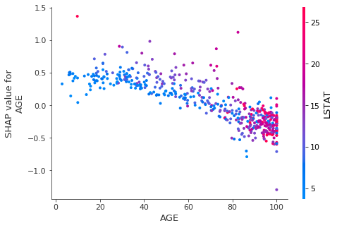
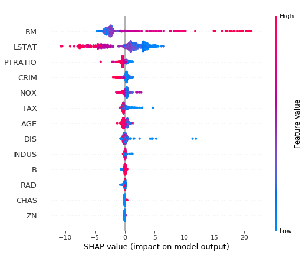
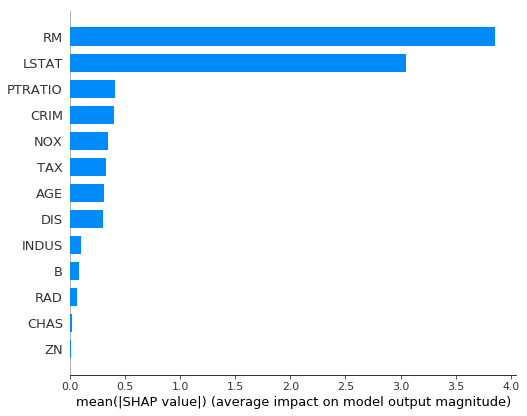

# SHAP (SHapley Additive exPlanations)
#### Using SHAP to see feature contribution to the target variable
Works with any sklear tree-based model & XGBoost, LightGBM, CatBoost

Library documentation:   
https://shap.readthedocs.io/en/latest/  
https://github.com/slundberg/shap#citations


```python
import shap
import pandas as pd 
from sklearn.datasets import load_boston
from sklearn.ensemble import RandomForestRegressor
from sklearn.model_selection import train_test_split, cross_val_score
```

### Load data into dataframe


```python
boston = load_boston()

# Create a Pandas dataframe with all the features
X = pd.DataFrame(data = boston['data'], columns = boston['feature_names'])
y = boston['target']
```


```python
# lists what we can extract from the sklearn toy dataset
dir(boston) 
```


['DESCR', 'data', 'feature_names', 'filename', 'target']


### Random Forest 


```python
# Split the data
Xtrain, Xtest, ytrain, ytest = train_test_split(X, y)
```


```python
rf_reg = RandomForestRegressor(n_estimators=100)
rf_reg.fit(Xtrain, ytrain)
```


    RandomForestRegressor(bootstrap=True, criterion='mse', max_depth=None,
               max_features='auto', max_leaf_nodes=None,
               min_impurity_decrease=0.0, min_impurity_split=None,
               min_samples_leaf=1, min_samples_split=2,
               min_weight_fraction_leaf=0.0, n_estimators=100, n_jobs=None,
               oob_score=False, random_state=None, verbose=0, warm_start=False)


```python
rf_train = rf_reg.score(Xtrain, ytrain)
rf_cv = cross_val_score(rf_reg, Xtrain, ytrain, cv=5).mean()
rf_test = rf_reg.score(Xtest, ytest)
print('Evaluation of the Random Forest performance\n')
print(f'Training score: {rf_train.round(4)}')
print(f'Cross validation score: {rf_cv.round(4)}')
print(f'Test score: {rf_test.round(4)}')
```

    Evaluation of the Random Forest performance
    
    Training score: 0.9788
    Cross validation score: 0.8396
    Test score: 0.7989
    

### SHAP values


```python
# Initialize JavaScript visualization
shap.initjs()
```


```python
# Effect of a single feature on the shap value,and automatically selected other feature to show dependence 
shap.dependence_plot('AGE', shap_values, X)
```





```python
# See how every feaure contributes to the model output
shap.summary_plot(shap_values, X)
```





```python
shap.summary_plot(shap_values, X, plot_type="bar")
```





```python
print(boston.DESCR)
```

    .. _boston_dataset:
    
    Boston house prices dataset
    ---------------------------
    
    **Data Set Characteristics:**  
    
        :Number of Instances: 506 
    
        :Number of Attributes: 13 numeric/categorical predictive. Median Value (attribute 14) is usually the target.
    
        :Attribute Information (in order):
            - CRIM     per capita crime rate by town
            - ZN       proportion of residential land zoned for lots over 25,000 sq.ft.
            - INDUS    proportion of non-retail business acres per town
            - CHAS     Charles River dummy variable (= 1 if tract bounds river; 0 otherwise)
            - NOX      nitric oxides concentration (parts per 10 million)
            - RM       average number of rooms per dwelling
            - AGE      proportion of owner-occupied units built prior to 1940
            - DIS      weighted distances to five Boston employment centres
            - RAD      index of accessibility to radial highways
            - TAX      full-value property-tax rate per $10,000
            - PTRATIO  pupil-teacher ratio by town
            - B        1000(Bk - 0.63)^2 where Bk is the proportion of blacks by town
            - LSTAT    % lower status of the population
            - MEDV     Median value of owner-occupied homes in $1000's
    
        :Missing Attribute Values: None
    
        :Creator: Harrison, D. and Rubinfeld, D.L.
    
    This is a copy of UCI ML housing dataset.
    https://archive.ics.uci.edu/ml/machine-learning-databases/housing/
    
    
    This dataset was taken from the StatLib library which is maintained at Carnegie Mellon University.
    
    The Boston house-price data of Harrison, D. and Rubinfeld, D.L. 'Hedonic
    prices and the demand for clean air', J. Environ. Economics & Management,
    vol.5, 81-102, 1978.   Used in Belsley, Kuh & Welsch, 'Regression diagnostics
    ...', Wiley, 1980.   N.B. Various transformations are used in the table on
    pages 244-261 of the latter.
    
    The Boston house-price data has been used in many machine learning papers that address regression
    problems.   
         
    .. topic:: References
    
       - Belsley, Kuh & Welsch, 'Regression diagnostics: Identifying Influential Data and Sources of Collinearity', Wiley, 1980. 244-261.
       - Quinlan,R. (1993). Combining Instance-Based and Model-Based Learning. In Proceedings on the Tenth International Conference of Machine Learning, 236-243, University of Massachusetts, Amherst. Morgan Kaufmann.
    
    
